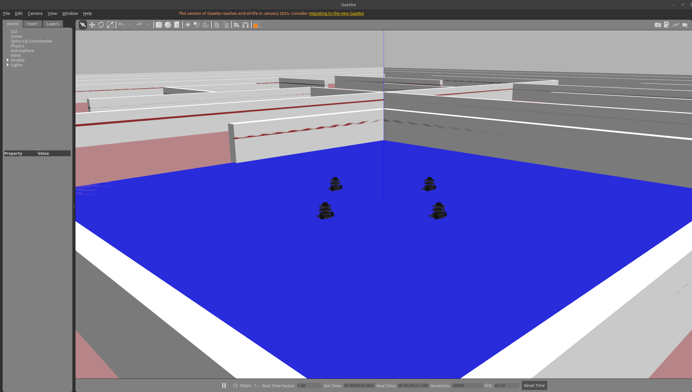
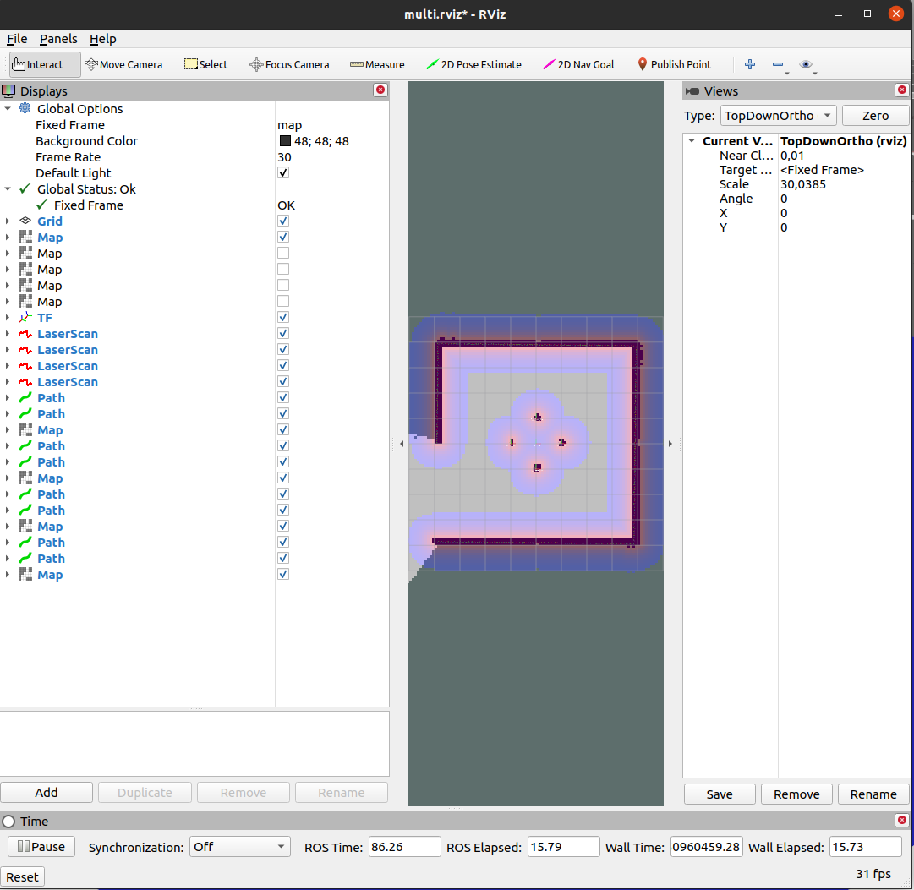
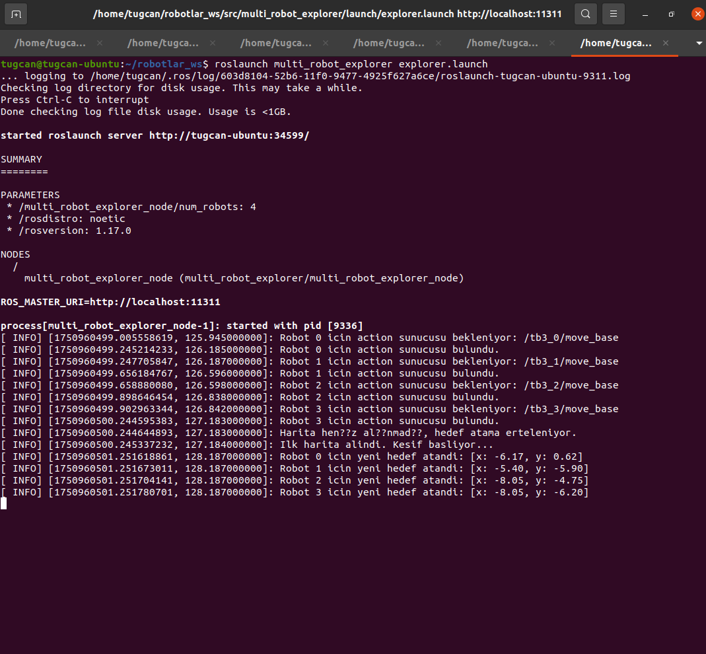
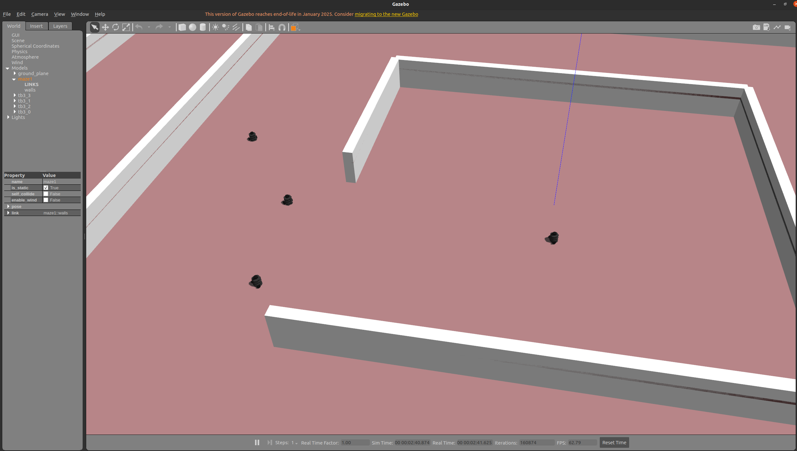
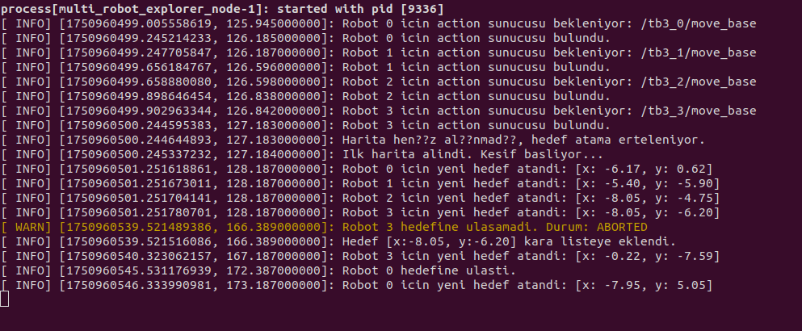
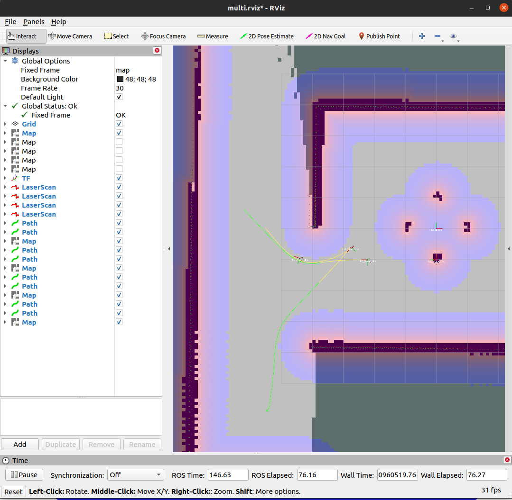
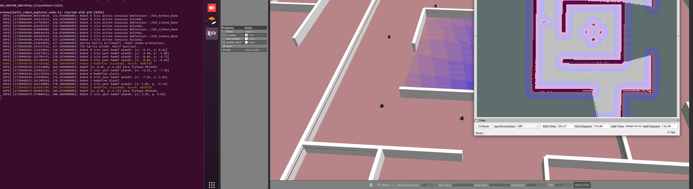
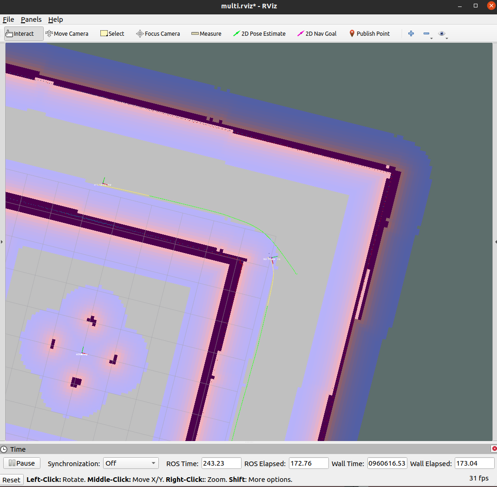
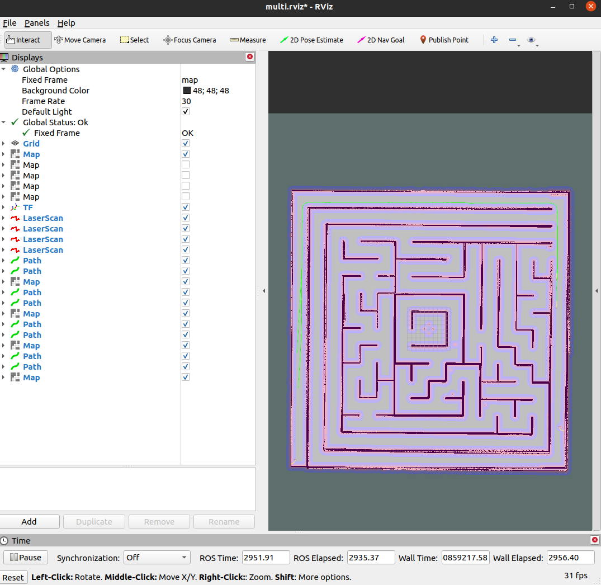

# Multi‑Robot Autonomous Exploration

This ROS package, prepared as a final assignment, performs autonomous mapping of a maze in the Gazebo simulation environment using **four TurtleBot3 robots**.  
The package automates exploration with a **frontier‑based exploration** method, intelligently directing robots toward unknown regions of the map.

## How the Project Works

The `multi_robot_explorer` node is the heart of the exploration logic:

1. **Map Analysis** – Continuously listens to the unified `/map` topic built from all robots’ sensor data.  
2. **Frontier Detection** – Detects the borders between known free space and unexplored areas; these borders are the most rational exploration targets.  
3. **Target Optimisation** – Because many frontier points can be very close, they are grouped with a *clustering* algorithm, and the centroid of each cluster becomes a candidate target.  
   *In testing, robots tended to get stuck without clustering, so it is enabled by default.*  
4. **Intelligent Task Assignment** – Each idle robot is assigned the nearest frontier target that is not already claimed by another robot.  
5. **Blacklist Mechanism** – A key feature. If a robot cannot reach an assigned target (e.g. the goal is behind a wall or the robot is trapped), that target is **blacklisted for the lifetime of the node**.
   Candidate centroids within 1 meter of a blacklisted target are skipped. Restarting the node clears this list; there is no timed expiry.
6. **Task Monitoring** – Goals are sent via the ROS `actionlib` interface, allowing reliable tracking of whether the robot has reached the goal or encountered problems.

---

## Dependencies

Use Linux with ROS1 Noetic and catkin installed. Source `/opt/ros/noetic/setup.bash` before creating or building a workspace. Install the following packages before running the project.

### System packages (install with APT)

* `ros-noetic-multirobot-map-merge` – merges maps from different robots.  
* `ros-noetic-dwa-local-planner` – local planner used by the `move_base` navigation stack.

### ROS packages (clone with Git)

* `micromouse_maze` – contains the simulation world and RViz configuration.  
* `turtlebot3` – core TurtleBot3 packages.  
* `turtlebot3_simulations` – Gazebo simulation packages for TurtleBot3.

---

## Installation Steps

1. **Create a workspace** (if you do not already have one):

   ```bash
   mkdir -p ~/robotlar_ws/src
   cd ~/robotlar_ws/
   catkin_make
   ```

2. **Install missing system packages**:

   ```bash
   sudo apt-get update
   sudo apt-get install ros-noetic-multirobot-map-merge ros-noetic-dwa-local-planner
   ```

3. **Clone the required repositories** into the workspace `src` folder:

   ```bash
   cd ~/robotlar_ws/src
   git clone https://gitlab.com/blm6191_2425b/blm6191/micromouse_maze.git
   git clone https://gitlab.com/blm6191_2425b/blm6191/turtlebot3.git
   git clone https://gitlab.com/blm6191_2425b/blm6191/turtlebot3_simulations.git
   ```

   Copy this `multi_robot_explorer` package into `~/robotlar_ws/src` as well.

4. **Build the workspace**:

   ```bash
   cd ~/robotlar_ws
   rosdep install --from-paths src --ignore-src -r -y
   catkin_make
   ```

   Start from a fresh workspace if its cache refers to another machine or ROS installation.

5. **Set the environment in each terminal**:

   ```bash
   source /opt/ros/noetic/setup.bash
   source ~/robotlar_ws/devel/setup.bash
   export TURTLEBOT3_MODEL=burger
   ```

   Source the ROS installation before creating or building the workspace as well.

---

## Launch Instructions

Start each of the following commands in **its own terminal**, waiting for the current terminal to finish initialisation before moving to the next.

1. **Terminal 1 – Gazebo simulation**  
   (Loads the maze and 4 robots.)

   ```bash
   roslaunch micromouse_maze micromouse_maze3_multi.launch
   ```

2. **Terminal 2 – Map merge**  
   (Merges the 4 individual maps into `/map`.)

   ```bash
   roslaunch turtlebot3_gazebo multi_map_merge.launch
   ```

3. **Terminal 3 – SLAM (mapping)**  
   (Starts `gmapping` for each robot.)

   ```bash
   roslaunch turtlebot3_gazebo multi_turtlebot3_slam.launch
   ```

4. **Terminal 4 – Navigation**  
   (Activates `move_base` planners and action servers for each robot.)

   ```bash
   roslaunch turtlebot3_navigation multi_move_base.launch
   ```

5. **Terminal 5 – RViz (visualisation)**  
   (Opens the interface to view robots, map and sensor data.)

   ```bash
   roslaunch micromouse_maze multi_robot_rviz.launch
   ```

6. **Terminal 6 – Autonomous exploration node**  
   (Start after all infrastructure is running.)

   ```bash
   roslaunch multi_robot_explorer explorer.launch
   ```

### Example Run

_When translating, some Turkish characters did not render correctly in the console; that is why “??” may appear in some screenshots. This was later fixed, so you should not encounter the issue._

With all six terminals running, you will first see the robots placed in the maze and the merged map beginning in RViz:





If the code is working, the robots receive their first tasks immediately, and **Terminal 6** displays:



You can see coordinate assignments for Robots 0‑3:



Robots begin moving as shown above. If a robot cannot find a clear path (e.g. the robot in the centre), it waits a short time, then automatically proceeds once the path is open:



The console shows `ABORTED` when a path is unreachable. The goal is black‑listed, a new goal is assigned, and exploration continues without deadlock.

Both RViz and Gazebo show planned paths (green lines) and robot motion:





You can monitor path assignments in the terminal, RViz and Gazebo:



After letting the system explore for a while, the map reaches its final state:



### Expected Outcome

After launching the final command:

* **Terminal 6** - Goal-assignment messages identify the robot and target coordinates.
* **RViz** – Robots automatically draw green paths toward unexplored areas.  
* If a robot cannot reach its goal, the node logs the terminal action state and adds the target to the blacklist. The robot becomes eligible for another target on the next assignment cycle.

Exploration ends automatically when no new frontier points remain and all robots have completed their tasks.

### Extra

To change the number of robots, edit the `num_robots` parameter in  
`multi_robot_explorer/launch/explorer.launch`:

```xml
<param name="num_robots" value="4" />
```

## Validation and operational limits

The launch parameter `num_robots` must be positive. Robot names are generated as `tb3_0`, `tb3_1`, and so on; each needs a matching `/<name>/move_base` action server and `<name>/base_footprint` transform into `map`. Goal assignment waits for disconnected action servers. Action callbacks run on the exploration loop's ROS callback queue so they cannot concurrently modify assignment and blacklist state.

The node rejects empty or inconsistent occupancy grids, nonpositive resolution and nonfinite map origins. It waits for known free space instead of declaring an all-unknown map complete. Frontier detection considers interior free cells with an unknown neighbor. Clustering uses a 1-meter connection threshold and selects the arithmetic centroid; that centroid can fall outside free space and may be rejected by navigation. Map origins are assumed to have no rotation. Blacklisting is permanent until restart, so blocked frontiers can remain while robots are idle; shutdown occurs only when a map has known free space, no raw frontiers remain and all robots are idle.

The standalone regression test checks empty, undersized, malformed and normal occupancy grids, including diagonal unknown neighbors and obstacle exclusion:

```bash
g++ -std=c++11 -Wall -Wextra -Werror multi_robot_explorer/test/frontier_cells_test.cpp -o /tmp/frontier_cells_test
/tmp/frontier_cells_test
```

In a built catkin workspace, run `ctest --test-dir build -R frontier_cells_test --output-on-failure`. These tests do not validate ROS transport, actionlib scheduling, TF, map merging, Gazebo navigation or real robots. Full acceptance needs ROS1 Noetic and the external multi-robot launch packages listed above. The screenshot sequence records the original assignment run.
